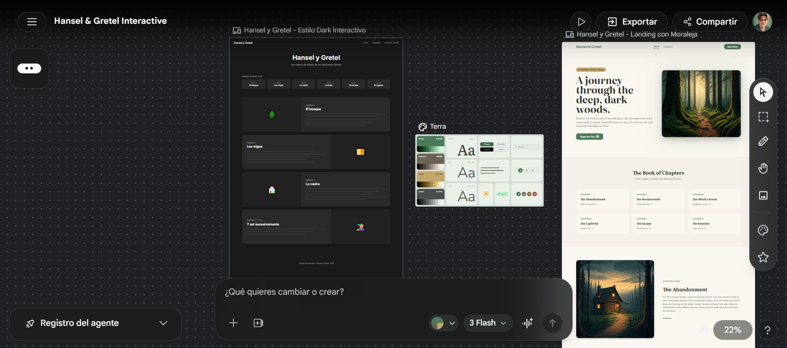

# 🌲 Hansel y Gretel 🌲

> *"Dejaron un rastro de migas... pero el bosque tiene hambre."*

## 📖 Descripción

Este proyecto forma parte de un ejercicio de Git donde el objetivo principal es practicar 
**cuándo y por qué** se realizan los commits, aplicando buenas 
prácticas como la atomicidad, los mensajes descriptivos y el flujo 
de trabajo con ramas.

Para contarlo, decidí adaptar el clásico cuento de los hermanos Grimm **Hansel y Gretel**: 
dos hermanos abandonados en lo más profundo de un bosque oscuro. 
Sin más guía que las estrellas y un rastro de migas de pan, su camino 
los llevó hasta algo inesperado: una casita hecha de chocolate y caramelo.

Pero las cosas dulces a veces esconden peligros amargos.

Su historia está contada capítulo a capítulo mediante HTML y CSS.

## 🔍 Análisis

Antes de programar analicé la historia de Hansel y Gretel para 
dividirla en momentos clave. Identifiqué 6 capítulos con un arco 
narrativo claro: desde el abandono en el bosque hasta el regreso 
a casa, pasando por el peligro de la bruja.

Cada capítulo tiene su propio peso emocional, por lo que decidí 
darle a cada uno su propia sección visual con imagen y texto.

## 🗺️ Capítulos

1. 🌲 El bosque
2. 🍞 Las migas
3. 🏠 La casita
4. 🧙‍♀️ La bruja
5. 🔥 La trampa
6. 🏡 El regreso a casa

## 📐 Planificación

Usé Stitch para prototipar el diseño visual antes de escribir 
código. Decidí una estructura clara:

- **Header**: título e imagen de portada del bosque
- **Nav**: índice interactivo con los 6 capítulos
- **Main**: un bloque por capítulo con imagen y texto
- **Moral**: reflexión final de la historia
- **Footer**: autoría y año

Cada sección se desarrolló en su propia rama de Git para 
mantener un historial limpio y ordenado.

## 🎨 Prototipo
Diseño planificado con Stitch antes de programar.

## 📋 Planificación de commits
- `chore`: add .gitignore
- `docs`: add README
- `feat`: add project folder structure
- `docs`: add prototype screenshot to README
- `feat`: add base HTML structure
- `style`: add CSS variables and color palette
- `style`: add Google Fonts
- `feat`: add header
- `style`: add header styles
- `feat`: add nav
- `style`: add nav styles
- `feat`: add chapter 1 - el bosque
- `feat`: add image chapter 1
- `style`: add chapter 1 styles
- `feat`: add chapter 2 - las migas
- `feat`: add image chapter 2
- `style`: add chapter 2 styles
- `feat`: add chapter 3 - la casita
- `feat`: add image chapter 3
- `style`: add chapter 3 styles
- `feat`: add chapter 4 - la bruja
- `feat`: add image chapter 4
- `style`: add chapter 4 styles
- `feat`: add chapter 5 - la trampa
- `feat`: add image chapter 5
- `style`: add chapter 5 styles
- `feat`: add chapter 6 - el regreso
- `feat`: add image chapter 6
- `style`: add chapter 6 styles
- `feat`: add moral lesson
- `style`: add moral styles
- `feat`: add footer
- `style`: add footer styles

## 🛠️ Tecnologías
- HTML5
- CSS3

